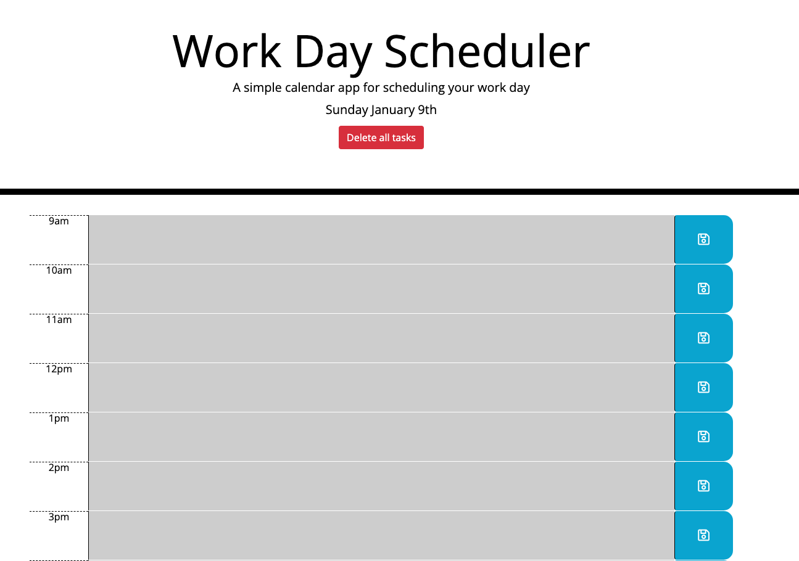

# Perfect Planner

Perfect Planner is a web application built on html leveraging boostrap and custom css with javascript and jquery.

The application displays the current date at the top of the screen.

Working hours are displayed with dynamic text entry and a save button next to each hour. You can enter in tasks next to each hour to organize your day.

The hours change color depending on if they are in the future, the past, or the current hour.

The application leverages moment.js to compute time functions.

This was developed by [Dan Evola](https://dmevola.github.io/portfolio/)

Its production URL is https://dmevola.github.io/perfect-planner/
